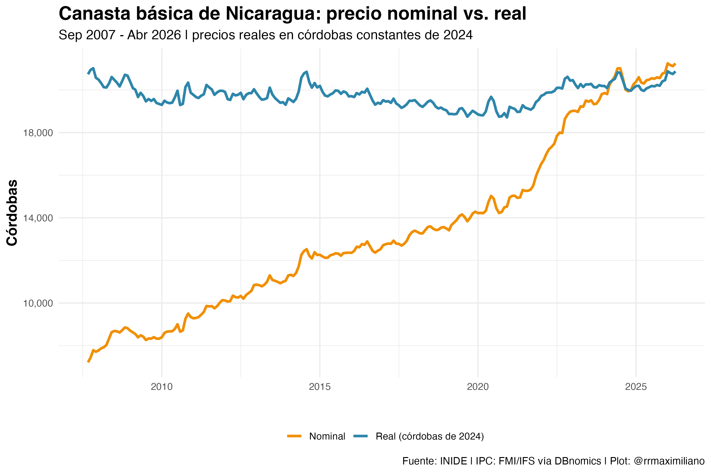
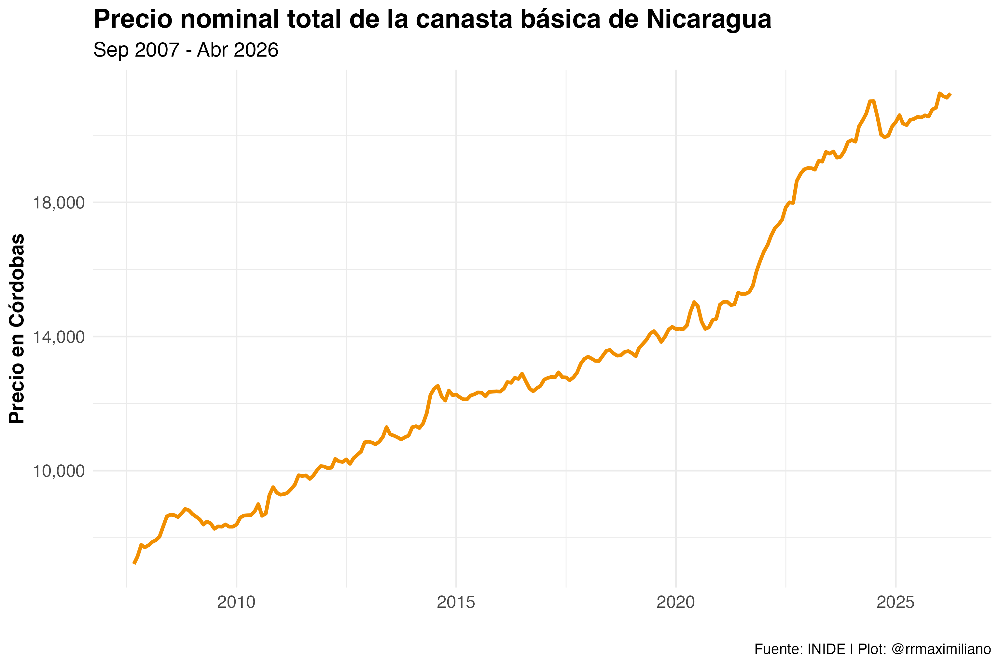
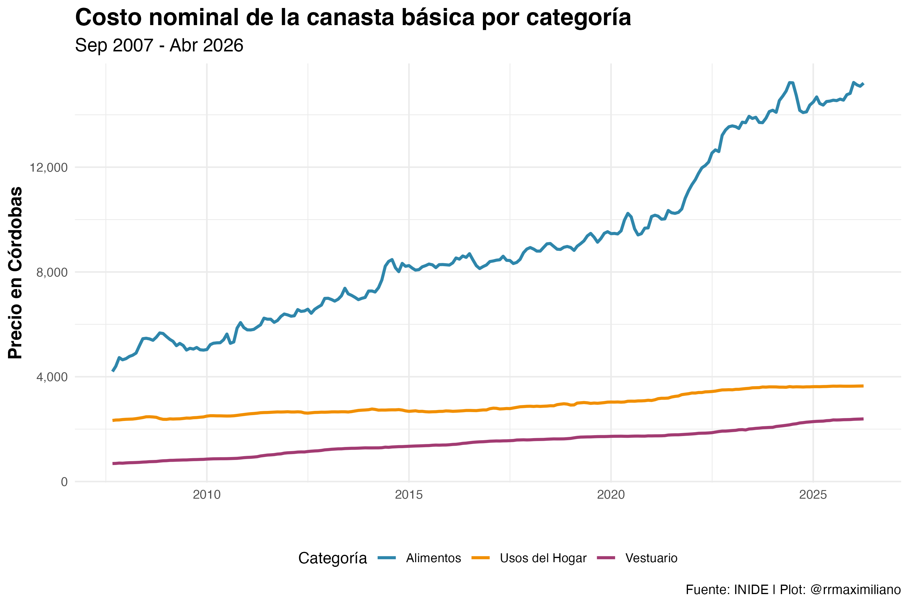
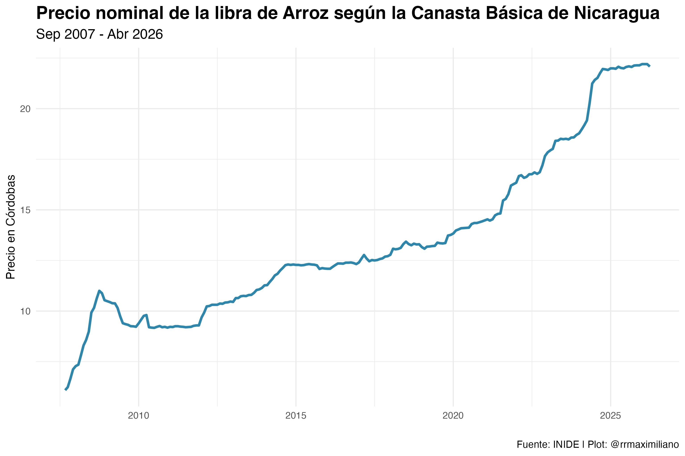
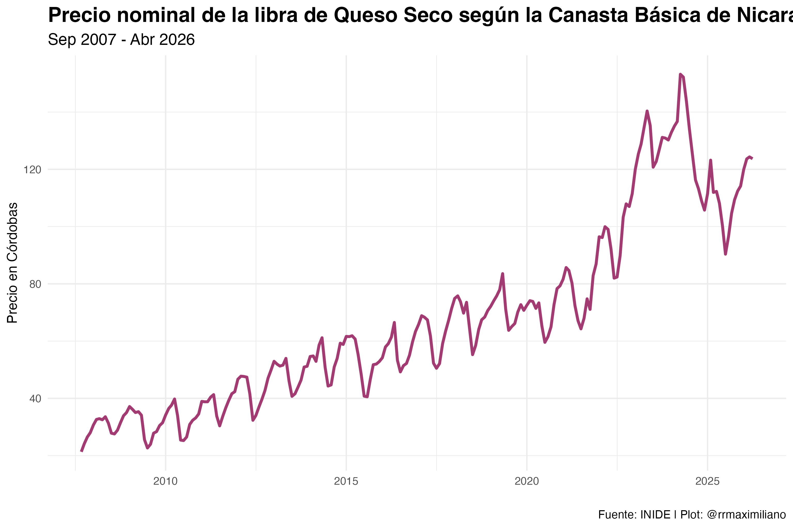

<!-- README.md is generated from README.Rmd. Please edit that file -->

```{r, include = FALSE}
knitr::opts_chunk$set(
  collapse = TRUE,
  comment = "#>"
)

library(dplyr)
library(readr)
library(lubridate)

canasta_basica <- read_rds("data/CB_FULL.rds")

month_levels <- c("Ene", "Feb", "Mar", "Abr", "May", "Jun",
                  "Jul", "Ago", "Sep", "Oct", "Nov", "Dic")

# Real-price base year (single source of truth)
source("R/ipc.R")

# Get data range for dynamic display
min_year <- min(canasta_basica$year)
max_year <- max(canasta_basica$year)

min_month_data <- canasta_basica %>%
  filter(year == min_year) %>%
  arrange(match(month, month_levels)) %>%
  slice(1)
min_month <- min_month_data$month

max_month_data <- canasta_basica %>%
  filter(year == max_year) %>%
  arrange(desc(match(month, month_levels))) %>%
  slice(1)
max_month <- max_month_data$month
total_goods <- length(unique(canasta_basica$good))

# Get recent data summary (nominal and real)
recent_data <- canasta_basica %>%
  filter(year >= max_year - 1) %>%
  group_by(year, month) %>%
  summarise(
    total_cost      = sum(total, na.rm = TRUE),
    total_cost_real = sum(total_real, na.rm = TRUE),
    .groups = "drop"
  ) %>%
  arrange(desc(year), desc(match(month, month_levels)))

latest_cost <- recent_data$total_cost[1]
previous_cost <- recent_data$total_cost[2]
cost_change <- round(((latest_cost - previous_cost) / previous_cost) * 100, 1)

# Category breakdown of the latest month
latest_cats <- canasta_basica %>%
  filter(year == max_year, month == max_month) %>%
  group_by(categoria) %>%
  summarise(costo = sum(total, na.rm = TRUE), .groups = "drop")

# Last update info
last_update <- Sys.Date()
```

# Canasta Básica de Nicaragua

<!-- badges: start -->
[](https://github.com/RRMaximiliano/inide-canasta-basica/actions/workflows/update-data.yml)
<!-- badges: end -->

## Qué hace este proyecto

Recolecta y visualiza automáticamente los datos de precios de la canasta básica de Nicaragua desde el sitio web oficial del INIDE. Además de los precios nominales, calcula **precios reales** (ajustados por inflación) y clasifica cada bien en su **categoría oficial**.

**Aplicación en vivo**: https://rrmaximiliano.shinyapps.io/inide-canasta-basica/

**Datos actuales** (actualizado: `r last_update`):
- **Cobertura**: `r min_month` `r min_year` - `r max_month` `r max_year`
- **Registros**: `r format(nrow(canasta_basica), big.mark = ",")` observaciones
- **Bienes**: `r total_goods` artículos únicos (limpios y estandarizados)
- **Categorías**: 3 grupos oficiales (Alimentos, Usos del Hogar, Vestuario)
- **Costo actual**: C$ `r format(round(latest_cost, 0), big.mark = ",")` (`r if(cost_change > 0) paste0("+", cost_change) else cost_change`% vs mes anterior)

**Actualización automática**: Este repositorio se actualiza automáticamente cada semana (los lunes) mediante GitHub Actions, descargando los datos más recientes del sitio web oficial del INIDE. Cuando hay un mes nuevo, se recompila el dataset, se regeneran las figuras y se redespliega la aplicación Shiny.

## Vista de los datos

```{r}
canasta_basica
```

### Tendencia reciente del costo total

```{r, echo = FALSE}
recent_data %>%
  head(12) %>%
  mutate(
    `Costo Total (nominal)` = paste("C$", format(round(total_cost, 0), big.mark = ",")),
    `Costo Total (real)`    = paste("C$", format(round(total_cost_real, 0), big.mark = ","))
  ) %>%
  select(Año = year, Mes = month, `Costo Total (nominal)`, `Costo Total (real)`) %>%
  knitr::kable()
```

*Precios reales en córdobas constantes de `r IPC_BASE_YEAR`.*

Cada base de datos contiene las siguientes variables:

* `yymm`: Año - Mes de la canasta básica.
* `year`: Año.
* `month`: Mes.
* `url`: URL de descarga de la página oficial del INIDE.
* `row`: Número oficial del bien (1-53).
* `good`: Nombre del bien (limpio y estandarizado).
* `medida`: Medida oficial de consumo.
* `cantidad`: Cantidad de consumo (en medida).
* `precio`: Precio nominal por medida.
* `total`: Gasto nominal del bien (cantidad × precio).
* `id`: Identificador interno del lote de descarga (artefacto del proceso de recolección; no identifica al bien).
* `ym`: Fecha del primer día del mes correspondiente (a partir de `year` y `month`).
* `categoria`: Grupo oficial del bien (Alimentos, Usos del Hogar, Vestuario).
* `ipc`: Índice de precios al consumidor de Nicaragua (FMI / IFS, base 2010 = 100) del mes.
* `ipc_estimado`: `TRUE` si el IPC del mes fue extrapolado (meses recientes aún sin dato oficial).
* `precio_real`: Precio real, en córdobas constantes de `r IPC_BASE_YEAR`.
* `total_real`: Gasto real, en córdobas constantes de `r IPC_BASE_YEAR`.

**Limpieza de datos**: Los datos han sido procesados para estandarizar los nombres de los bienes y corregir inconsistencias. Por ejemplo, variaciones como "Pasta dental" y "Pastas dental" se han unificado, y se han diferenciado artículos similares como "Calcetines (Hombre)" y "Calcetines (Niños y Niñas)". La limpieza se aplica automáticamente durante el proceso de recolección de datos.

## Categorías

La canasta básica de 53 productos se organiza en los tres grupos oficiales del INIDE:

```{r, echo = FALSE}
latest_cats %>%
  arrange(match(categoria, c("Alimentos", "Usos del Hogar", "Vestuario"))) %>%
  mutate(`Costo del grupo` = paste("C$", format(round(costo, 0), big.mark = ","))) %>%
  select(Categoría = categoria, `Costo del grupo`) %>%
  knitr::kable()
```

*Desglose del último mes disponible (`r max_month` `r max_year`).*

## Precios reales (ajustados por inflación)

Los precios nominales no son comparables a lo largo de 18 años: gran parte del aumento refleja inflación general, no encarecimiento real. Por eso el dataset incluye **precios reales** en córdobas constantes de `r IPC_BASE_YEAR`, deflactados con el Índice de Precios al Consumidor (IPC) mensual de Nicaragua publicado por el FMI (International Financial Statistics, base 2010 = 100), obtenido vía la API de DBnomics. Los meses más recientes que aún no tienen IPC oficial usan el último valor disponible (marcados con `ipc_estimado = TRUE`).

```{r, echo = FALSE}

```

## Ejemplos

```{r, echo = FALSE}




```

## Cómo usar estos datos

Los datos están disponibles directamente desde GitHub en formato CSV, RDS y Stata:

```r
# R
library(readr)
canasta <- read_csv("https://raw.githubusercontent.com/RRMaximiliano/inide-canasta-basica/main/data/CB_FULL.csv")

# R (formato nativo, conserva tipos)
canasta <- readRDS(url("https://raw.githubusercontent.com/RRMaximiliano/inide-canasta-basica/main/data/CB_FULL.rds"))
```

```python
# Python
import pandas as pd
canasta = pd.read_csv("https://raw.githubusercontent.com/RRMaximiliano/inide-canasta-basica/main/data/CB_FULL.csv")
```

```stata
* Stata
import delimited "https://raw.githubusercontent.com/RRMaximiliano/inide-canasta-basica/main/data/CB_FULL.csv", clear
* o descargue el .dta:
* copy "https://raw.githubusercontent.com/RRMaximiliano/inide-canasta-basica/main/data/CB_FULL.dta" CB_FULL.dta
* use CB_FULL.dta, clear
```

**Cita sugerida**: Rodríguez Ramírez, R. M. (`r format(last_update, "%Y")`). *Canasta Básica de Nicaragua* [conjunto de datos]. https://github.com/RRMaximiliano/inide-canasta-basica. Fuente primaria: INIDE; IPC: FMI / IFS.

## Estructura del Proyecto

```
├── 01_files.R              # Configuración de URLs para datos históricos (legado)
├── 02_scrape.R             # Script original de recolección (histórico)
├── 02_scrape_auto.R        # Recolector automatizado (actual)
├── 03_plots.R              # Generación de figuras
├── app.R                   # Aplicación web Shiny
├── README.Rmd              # Fuente de documentación
├── R/                      # Lógica compartida (single source of truth)
│   ├── clean_canasta_data.R  # Limpieza y estandarización
│   ├── categories.R          # Mapeo de bienes a categorías oficiales
│   ├── ipc.R                 # IPC y cálculo de precios reales
│   └── compile_canasta.R     # Pipeline completo
├── scripts/                # Utilidades de mantenimiento y validación
│   └── validate_data.R       # Validación automática (corre en CI)
├── tests/                  # Pruebas de la lógica de compilación
├── data/
│   ├── CB_FULL.rds         # Dataset principal (limpio)
│   ├── CB_FULL.csv         # Versión CSV
│   ├── CB_FULL.dta         # Versión Stata
│   ├── ipc_nicaragua.csv   # Serie de IPC mensual (caché)
│   └── monthly/            # Archivos mensuales individuales
└── .github/workflows/      # Automatización GitHub Actions
```

## Cómo funciona

1. **Automatización semanal**: GitHub Actions se ejecuta cada lunes
2. **Detección inteligente**: Solo descarga datos nuevos del sitio web del INIDE
3. **Compilación**: Estandariza nombres, asigna categorías y calcula precios reales
4. **Validación**: `scripts/validate_data.R` verifica la integridad antes de publicar
5. **Actualización de app**: La aplicación Shiny se redespliega con los datos más recientes

## Características principales

- **Completamente automatizado**: No requiere intervención manual
- **Calidad de datos**: Nomenclatura consistente y validación automática en CI
- **Precios reales**: Ajustados por inflación (IPC de Nicaragua)
- **Categorías**: Cada bien clasificado en su grupo oficial
- **Siempre actualizado**: Se actualiza semanalmente con los datos más recientes
- **Interactivo**: Aplicación web para exploración de datos
- **Múltiples formatos**: Archivos RDS, CSV y Stata disponibles
- **Código abierto**: Todo el código disponible en GitHub

## Contacto y contribuciones

Para comentarios, sugerencias o contribuciones:
- **Email**: rodriguezramirez@worldbank.org
- **Issues**: <https://github.com/RRMaximiliano/inide-canasta-basica/issues>
- **Fuente de datos**: INIDE Nicaragua

---

*Mantenido por @RRMaximiliano | Última actualización: `r last_update`*
