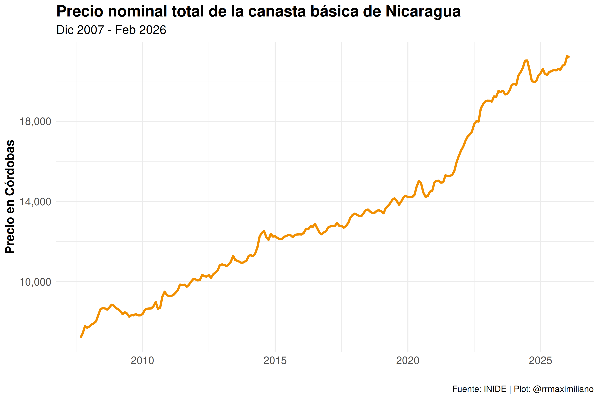
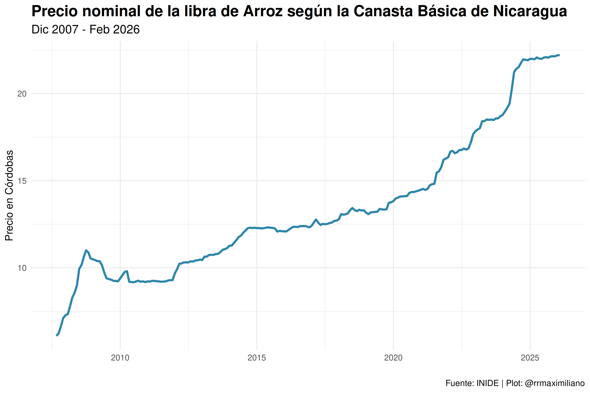
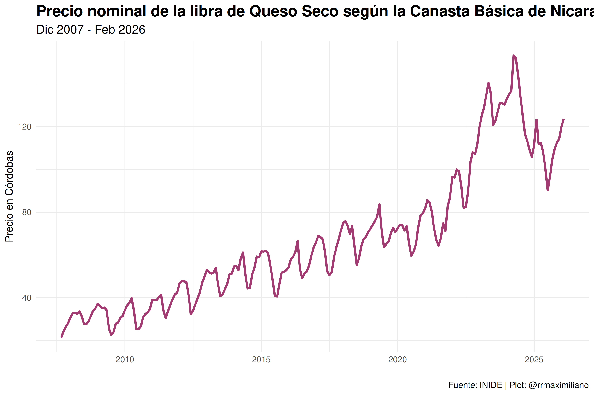

<!-- README.md is generated from README.Rmd. Please edit that file -->

# Canasta Básica de Nicaragua

<!-- badges: start -->
<!-- badges: end -->

Este repositorio contiene todos los datos disponibles de la canasta
básica de Nicaragua desde septiembre del año 2007 a junio del año 2023.
Los datos se encuentran en la subcaprta `data` y también están
disponibles por cada mes en la subcarpeta `data/monthly`.

``` r
canasta_basica
#> # A tibble: 10,070 × 11
#>    yymm       year month url      row   bien  medida cantidad precio total    id
#>    <glue>    <int> <fct> <chr>    <chr> <chr> <chr>     <dbl>  <dbl> <dbl> <int>
#>  1 CB2007Sep  2007 Sep   https:/… 1     Arroz Libra        38   6.09  231.     1
#>  2 CB2007Sep  2007 Sep   https:/… 2     Frij… Libra        34  10.4   355.     1
#>  3 CB2007Sep  2007 Sep   https:/… 3     Azúc… Libra        30   4.83  145.     1
#>  4 CB2007Sep  2007 Sep   https:/… 4     Acei… Litro         7  24.1   169.     1
#>  5 CB2007Sep  2007 Sep   https:/… 5     Post… Libra         8  32.9   263.     1
#>  6 CB2007Sep  2007 Sep   https:/… 6     Post… Libra         5  30.0   150.     1
#>  7 CB2007Sep  2007 Sep   https:/… 7     Carn… Libra         8  17.0   136.     1
#>  8 CB2007Sep  2007 Sep   https:/… 8     Pesc… Libra         9  35.6   320.     1
#>  9 CB2007Sep  2007 Sep   https:/… 9     Lech… Litro        30  10.5   315      1
#> 10 CB2007Sep  2007 Sep   https:/… 10    Huev… Docena        7  21.4   150.     1
#> # ℹ 10,060 more rows
```

Cada base de datos contiene las siguientes variables:

- `yymm`: Año - Mes de la canasta básica.
- `year`: Año.
- `month`: Mes.
- `url`: URL de descarga de la página oficial del INIDE.
- `row`: ID del bien. En total se encuentran 53 bienes.
- `bien`: Nombre del bien.
- `medida`: Medida oficial de consumo.
- `cantidad`: Cantidad de consumo (en medida).
- `precio`: Precio por medida.
- `total`: Total de consumo.

La base de datos mantiene los nombres originales de cada bien que es
incluído en la canasta básica. Por ejemplo, para los años 2007 al 2009,
se mantuvo el nombre de “Pescado” y fue cambiado por “Chuleta de
Pescado” en los años siguients. Me queda limpiar estas discrepancias.

## Ejemplos



## Comentarios y sugerencias

Para realizar comentarios o sugerencias sobre la base de datos puedes
escribirme a <rodriguezramirez@worldbank.org> o abrir un issue en este
repositorio:
<https://github.com/RRMaximiliano/inide-canasta-basica/issues>
