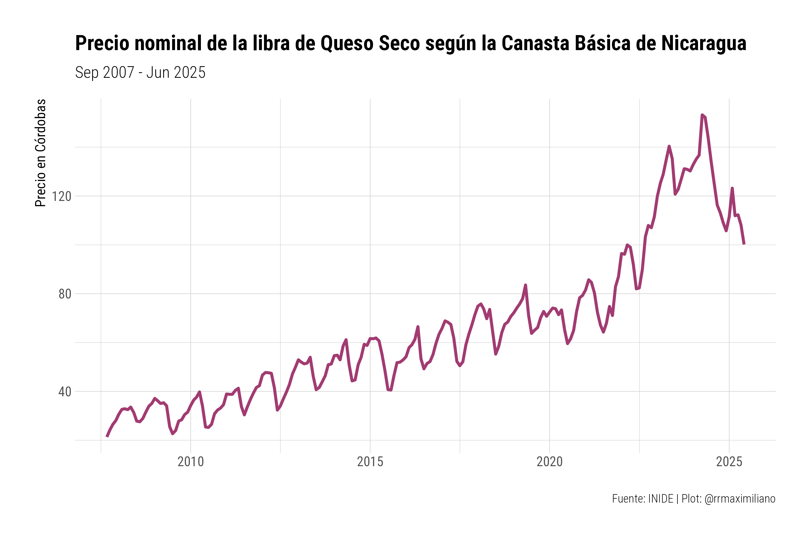

<!-- README.md is generated from README.Rmd. Please edit that file -->


# Canasta Básica de Nicaragua

<!-- badges: start -->
[](https://github.com/RRMaximiliano/inide-canasta-basica/actions/workflows/update-data.yml)
<!-- badges: end -->

## 🎯 Qué hace este proyecto

Recolecta y visualiza automáticamente los datos de precios de la canasta básica de Nicaragua desde el sitio web oficial del INIDE.

**🌐 Aplicación en vivo**: https://rrmaximiliano.shinyapps.io/inide-canasta-basica/

**📊 Datos actuales** (actualizado: 2025-07-20):
- **Cobertura**: Sep 2007 - Jun 2025
- **Registros**: 11,342 observaciones
- **Bienes**: 53 artículos únicos (limpios y estandarizados)
- **Costo actual**: C$ 20,487 (+0.1% vs mes anterior)

**🔄 Actualización automática**: Este repositorio se actualiza automáticamente cada mes el día 15 mediante GitHub Actions, descargando los datos más recientes del sitio web oficial del INIDE. 

## 📈 Vista de los datos


``` r
canasta_basica
#> # A tibble: 11,342 × 12
#>    yymm       year month url      row   good  medida cantidad precio total    id
#>    <glue>    <dbl> <fct> <chr>    <chr> <chr> <chr>     <dbl>  <dbl> <dbl> <dbl>
#>  1 CB2007Sep  2007 Sep   https:/… 1     Arroz libra        38   6.09  231.     1
#>  2 CB2007Sep  2007 Sep   https:/… 2     Frij… libra        34  10.4   355.     1
#>  3 CB2007Sep  2007 Sep   https:/… 3     Azúc… libra        30   4.83  145.     1
#>  4 CB2007Sep  2007 Sep   https:/… 4     Acei… litro         7  24.1   169.     1
#>  5 CB2007Sep  2007 Sep   https:/… 5     Post… libra         8  32.9   263.     1
#>  6 CB2007Sep  2007 Sep   https:/… 6     Post… libra         5  30.0   150.     1
#>  7 CB2007Sep  2007 Sep   https:/… 7     Carn… libra         8  17.0   136.     1
#>  8 CB2007Sep  2007 Sep   https:/… 8     Chul… libra         9  35.6   320.     1
#>  9 CB2007Sep  2007 Sep   https:/… 9     Leche litro        30  10.5   315      1
#> 10 CB2007Sep  2007 Sep   https:/… 10    Huev… docena        7  21.4   150.     1
#> # ℹ 11,332 more rows
#> # ℹ 1 more variable: ym <date>
```

### Tendencia reciente del costo total


|  Año|Mes |Costo Total |
|----:|:---|:-----------|
| 2025|Jun |C$ 20,487   |
| 2025|May |C$ 20,457   |
| 2025|Abr |C$ 20,303   |
| 2025|Mar |C$ 20,352   |
| 2025|Feb |C$ 20,601   |
| 2025|Ene |C$ 20,394   |
| 2024|Dic |C$ 20,260   |
| 2024|Nov |C$ 19,993   |
| 2024|Oct |C$ 19,942   |
| 2024|Sep |C$ 20,018   |
| 2024|Ago |C$ 20,559   |
| 2024|Jul |C$ 21,019   |


Cada base de datos contiene las siguientes variables:

* `yymm`: Año - Mes de la canasta básica.
* `year`: Año.
* `month`: Mes.
* `url`: URL de descarga de la página oficial del INIDE.
* `row`: ID del bien. En total se encuentran 53 bienes.
* `good`: Nombre del bien (limpio y estandarizado).
* `medida`: Medida oficial de consumo.
* `cantidad`: Cantidad de consumo (en medida).
* `precio`: Precio por medida.
* `total`: Total de consumo.

**Limpieza de datos**: Los datos han sido procesados para estandarizar los nombres de los bienes y corregir inconsistencias. Por ejemplo, variaciones como "Pasta dental" y "Pastas dental" se han unificado, y se han diferenciado artículos similares como "Calcetines (Hombre)" y "Calcetines (Niños y Niñas)". La limpieza se aplica automáticamente durante el proceso de recolección de datos.

## Ejemplos

<div class="figure">

<p class="caption">plot of chunk unnamed-chunk-4</p>
</div><div class="figure">

<p class="caption">plot of chunk unnamed-chunk-4</p>
</div><div class="figure">

<p class="caption">plot of chunk unnamed-chunk-4</p>
</div>

## 📁 Estructura del Proyecto

```
├── 01_files.R              # Configuración de URLs para datos históricos
├── 02_scrape.R              # Script original de recolección (histórico)
├── 02_scrape_auto.R         # Recolector automatizado (actual/futuro)
├── app.R                    # Aplicación web Shiny
├── README.Rmd               # Fuente de documentación
├── data/
│   ├── CB_FULL.rds          # Dataset principal (limpio)
│   ├── CB_FULL.csv          # Versión CSV
│   └── monthly/             # Archivos mensuales individuales
└── .github/workflows/       # Automatización GitHub Actions
```

## 🔄 Cómo funciona

1. **Automatización mensual**: GitHub Actions se ejecuta el día 15 de cada mes
2. **Detección inteligente**: Solo descarga datos nuevos del sitio web del INIDE
3. **Limpieza de datos**: Estandariza automáticamente nombres de bienes y corrige inconsistencias
4. **Actualización de app**: La aplicación Shiny muestra los datos más recientes automáticamente

## 🚀 Características principales

- ✅ **Completamente automatizado**: No requiere intervención manual
- ✅ **Calidad de datos**: Nomenclatura consistente y validación
- ✅ **Siempre actualizado**: Se actualiza mensualmente con los datos más recientes
- ✅ **Interactivo**: Aplicación web para exploración de datos
- ✅ **Múltiples formatos**: Archivos RDS, CSV y Stata disponibles
- ✅ **Código abierto**: Todo el código disponible en GitHub

## 🛠 Para desarrolladores

**Ejecutar localmente:**

```r
# Obtener datos más recientes
Rscript 02_scrape_auto.R

# Lanzar aplicación Shiny
shiny::runApp("app.R")
```

**Funciones principales:**
- Recolección de datos: `02_scrape_auto.R`
- Limpieza de datos: Integrada en el recolector
- Visualización: `app.R`

## 📈 Impacto

Este proyecto proporciona a investigadores, formuladores de políticas y ciudadanos:

- Tendencias históricas de precios de bienes básicos
- Recolección automatizada de datos de fuentes oficiales
- Herramientas interactivas para análisis económico
- Acceso abierto a datos limpios y estandarizados

## 📞 Contacto y contribuciones

Para comentarios, sugerencias o contribuciones:
- **Email**: rodriguezramirez@worldbank.org
- **Issues**: <https://github.com/RRMaximiliano/inide-canasta-basica/issues>
- **Fuente de datos**: INIDE Nicaragua

---

*Mantenido por @RRMaximiliano | Última actualización: 2025-07-20*
